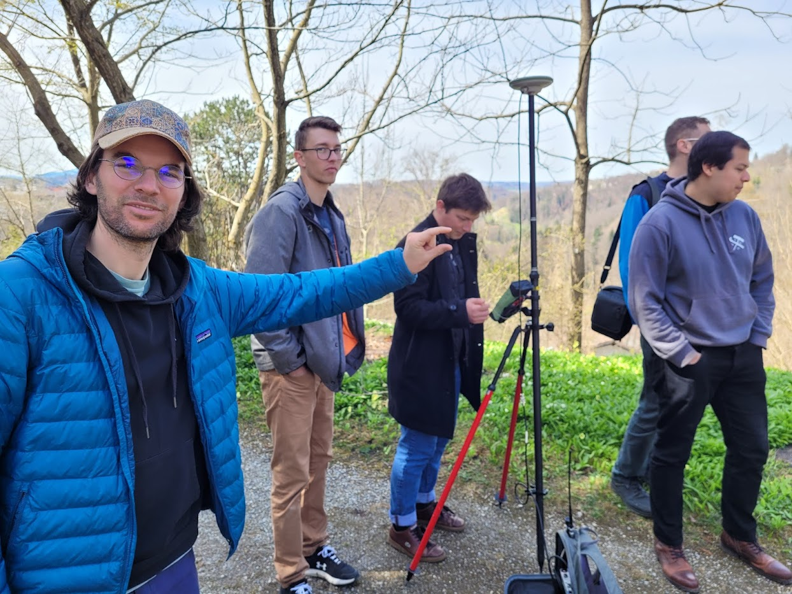
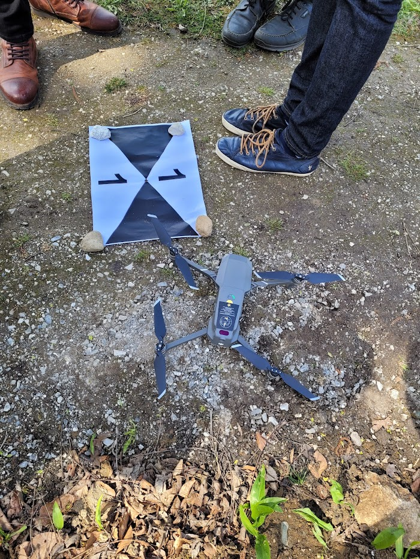

To do the drone map, we firstly put 8 ground markers (Figure 3) all around the botanical garden. Thes control points (Figure 1) are geolocated with a differential GPS that permits to obtain data with an error of less than 3 centimenters (Figure 2). After that, we make the drone fly with an app called "DroneDeploy" that automatically makes fly the drone (Figure 3) and takes pictures of the zone to have a complete mapping.

{max-width : 600px, display: block, margin: 0 auto}*Figure 1 : Map of the Fribourg botanical garden with control points ([[biblio._d]]).*

{max-width : 600px, display: block, margin: 0 auto}*Figure 2 : Leica differential GPS with the GSM technology*

{max-width : 600px, display: block, margin: 0 auto}*Figure 3 : DJI Mavic pro 2 drone with the first ground marker*

With these steps, we obtain approximatively 260 high quality pictures with the geolocated ground markers visible on them. We treat them with the agisoft software to obtain the geolocated map (Figure 4) on QGIS. To see the details of the operations, you can click [there](methodology.agisoft.md).

{max-width : 600px, display: block, margin: 0 auto}*Figure 4 : DBGI map with the pilot samples ([[_d]]).*

To add the samples (Figure 4), we have made a vector points layer in QGIS. Then we sync this QGIS project online in QFIeldCloud. With the QField app, we can go with a smartphone on the field and add the samples one by one when we prelevate. Then, we can push the field data and synchronize them with the QGIs project

Then, we can extract the WGS84 coordinates from the QGIS project in a CSV to add them on Inaturalist to have the high precision sample geolocation.

## Acknowledgements

The creation of the drone map has been made possible with the help the Geosciences department, geography unit of the University of Fribourg. Special thanks are due to Reynald Delaloye (UNIFR) and Horst Machguth (UNIFR) for the Differential GPS and drone loan and the explanations provided about their utilisation.