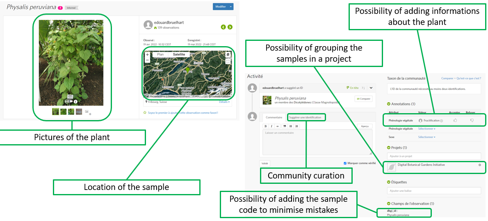

> "iNaturalist is an online social network of people sharing biodiversity information to help each other learn about nature" ([[biblio._f]])

iNaturalist allows to link our samples with pictures, DBGI sample code and location. We can precise the plant phenology too. It contains a community curation system linked with a machine learning technology to correct or add an identification of each sampled plants.

We can create projects with a delimited area where each added plant will automatically fit in when uploaded. This is what we have done with the Jardin Botanique de l'Université de Fribourg. With this, all our samples are grouped together. This allows then to export the data in batch with the [pyinaturalist client](https://pyinaturalist.readthedocs.io/en/latest/index.html) for the iNaturalist API, to obtain all these informations on a CSV file.

{max-width : 600px, display: block, margin: 0 auto}*iNaturalist page of Physalis peruviana with all the usefull fields described*

For now, we haven't found a satisfying automatized manner to import pictures and locations from the drone map. However, it seems to be possible to directly link the pictures taken on the field with the plant name and the location to make automated batch imports using [QField](https://www.dbgi.org/dendron-dbgi/notes/s2z62u99lhdo7dvz3093fbb/).