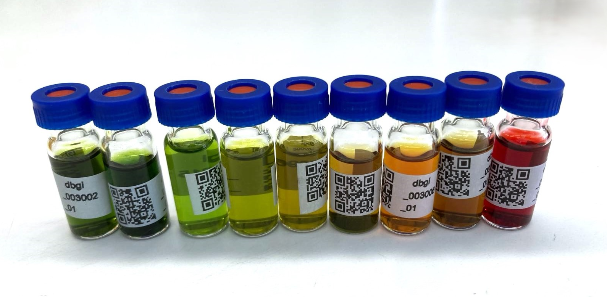

## Situation 
For this part of the Digital Botanical Garden Initiative the Tropical greenhouse will be collected. This tropical greenhouse is located in the botanical garden of Fribourg and contained about 280 tropical plant species with no specific taxonomic or provenance links. This area contains aquatic, epiphytic, terrestrial and others. 

## Collection
The collection method consists of cutting one or several leaves (depending on the size), wrap them in a coffee filter and put them in a falcon tube. Each falcon tube is  pre-labelled with a unique code assigned to the extract and use as an identifer throughout the experiments. 
the tube are then store in liquid nitrogen and finally put in the freezer (-80°C) if they are not freeze-dried immediatly. Each collected plant, will be report as a point on a qfield map, with several additional data such as the precise locatation, identification of the plant if possible and minimum five photos. These photos show : 
1) The plant identification pannel
2) The plant identification pannel with the labelled falcon tube 
3) A general photo of the plant 
4) A detail photo of the plant 
5) The cutting area with the scalpel 
6) An additional photo can be taken if necessary 

These photos are then upload on iNaturalist for checking the identification of the plant. This provides a check by external experts and enables us to correct our identifications if necessary. It also benefits iNaturalist, as some plants not included in the database have been added. 

## Extraction 
All plant extracts are freeze-dried and store in a container. 

The first step is to weigh out 50 micrograms of each extract and place it in an eppendorf 2ml with rounded bottom. We accepted an 5% of the weight as an error (±2.5 micrograms). Then add thee metal beads (4mm) inside the tube which will be used to crush the extracts.

The sample are then passed in the Retsch machine (shaker) for 2.5 minutes at 25Hz. In this process, the plants are ground to a fine powder. 
{max-width : 600px, display: block, margin: 0 auto}*Figure 2 : Eppendoft tubes with grounded plants*

Once the plants have been ground, the tubes are carefully reopened and 1.7 ml of the extraction solution is pipetted into each tube. The extraction solution mix is composed of 80% methanol, 20% distilled water and 0.1% formic acid. The tubes are then returned to the Restch machine to be shaken again for 2.5 minutes at 25Hz.They are then centrifuged for 2 minutes at 13'000RPM to separate the supernatant from the plant deposits. 

Finally, the supernatant is collected and pipetted into a vials tube with hermetically sealed caps. Approximately 1.4 ml of supernatant can be recovered. These tubes are then stored in a labelled container at -80°C.

{max-width : 600px, display: block, margin: 0 auto}*Figure 1 : Vials tube containing extracts of various plants from the tropical greenhouse.*

## Analyse
Some aliquots are made with the vial tubes with 120 microliter of the plant extract. These aliquots are analyzed by liquid chromatography mass spectrometry. So that the molecules are separed by their weight.

## Sample Tracking 
Because of the large number of samples, it is important to have reliable sample tracking. As said before, as soon as the samples are collected, each plant is assigned a unique code. This code will follow the plant through each stage of extraction, analysis and storage. This unique code will be report on each different tube during the extraction process and all data relating to this sample are added to the database.
By consulting this database, we can quickly find out which plant has already been extracted, how many times it has been extracted, the exact weight that have been extracted and in which container the various tubes are stored. The whole process is automated, and the database automatically updated. 
