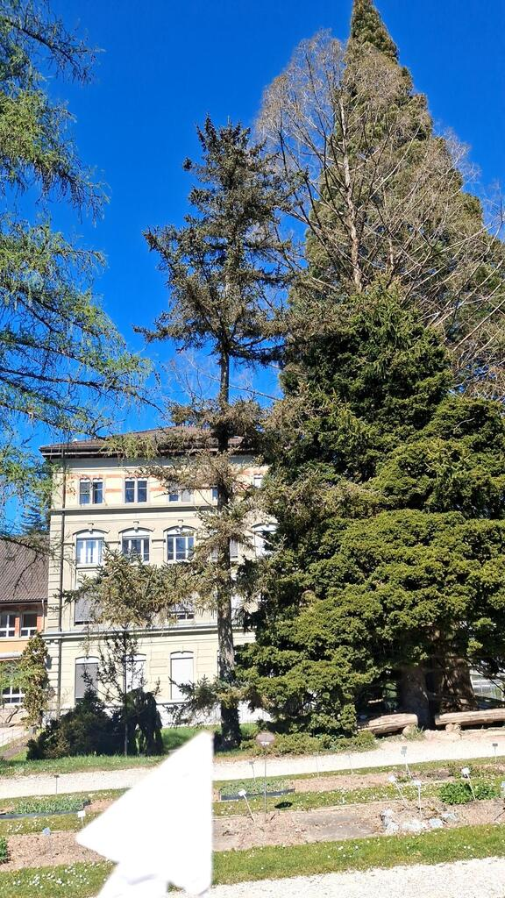
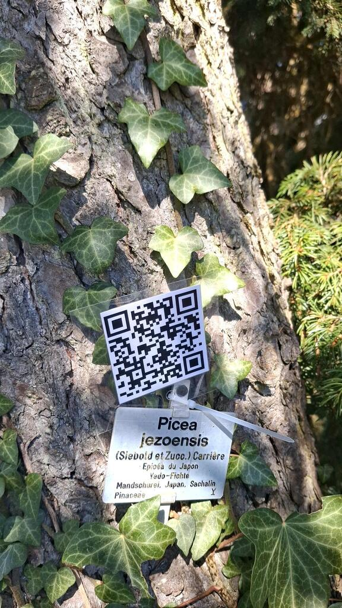
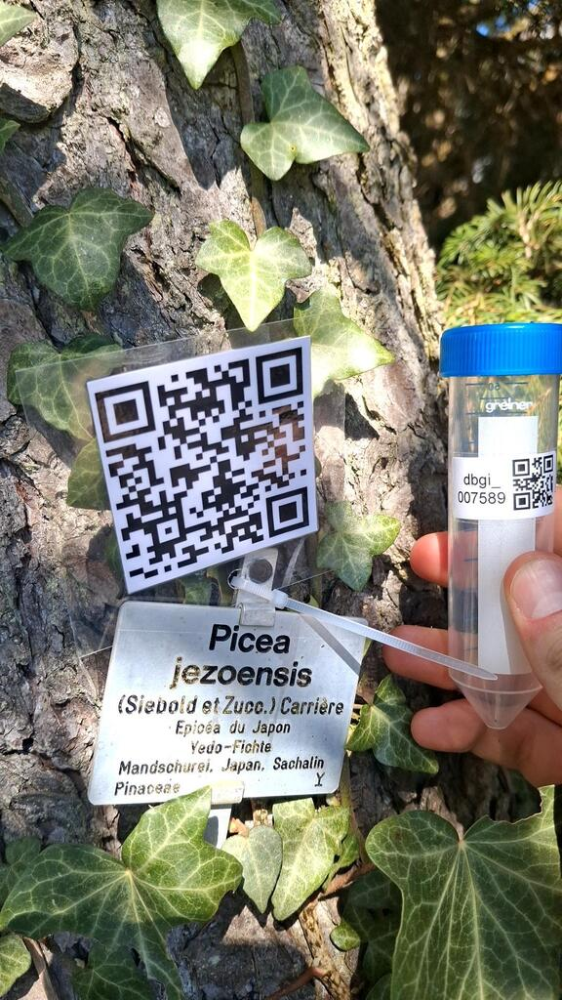
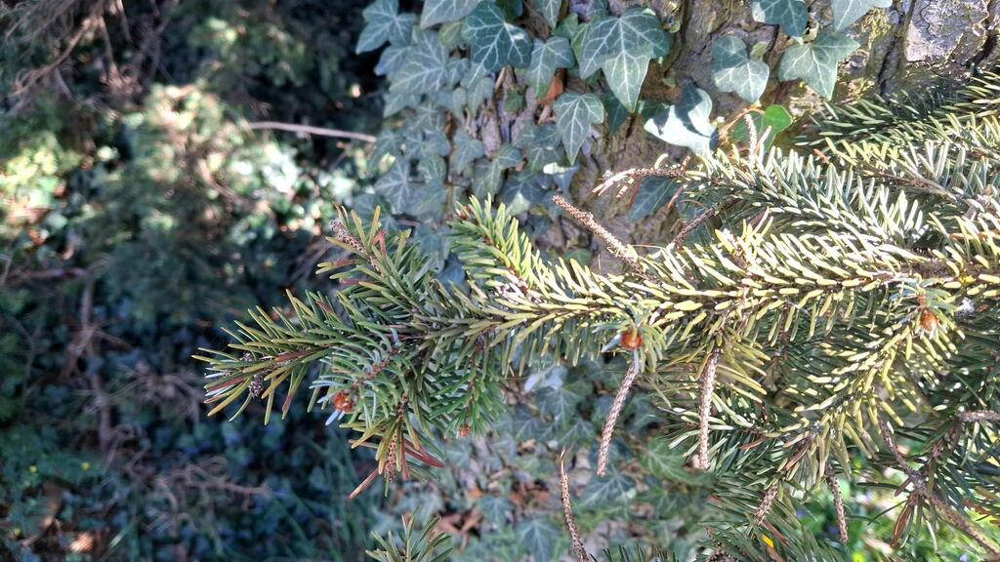
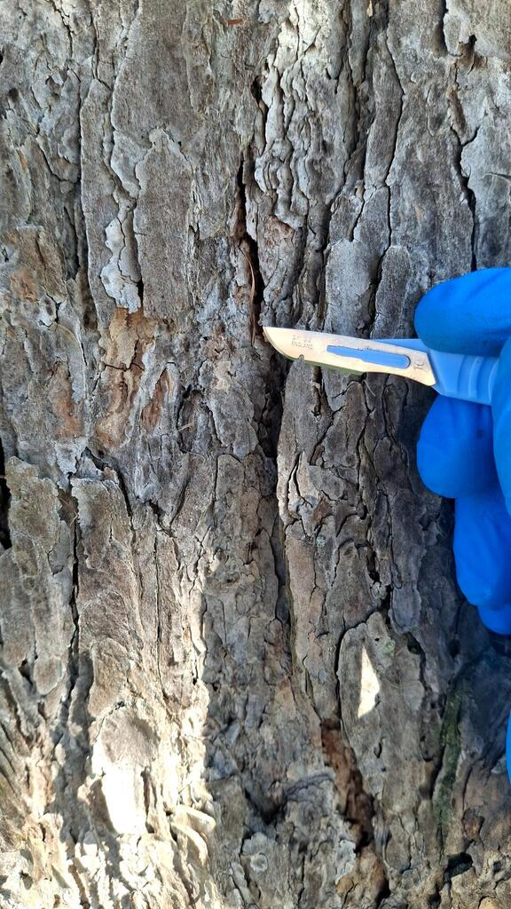
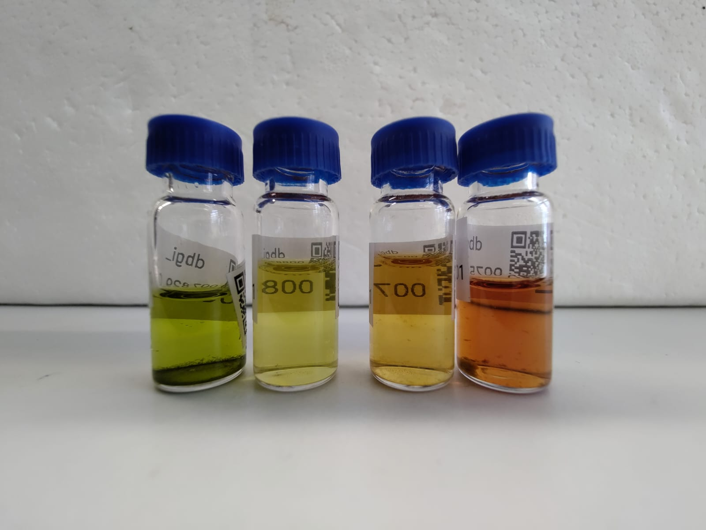
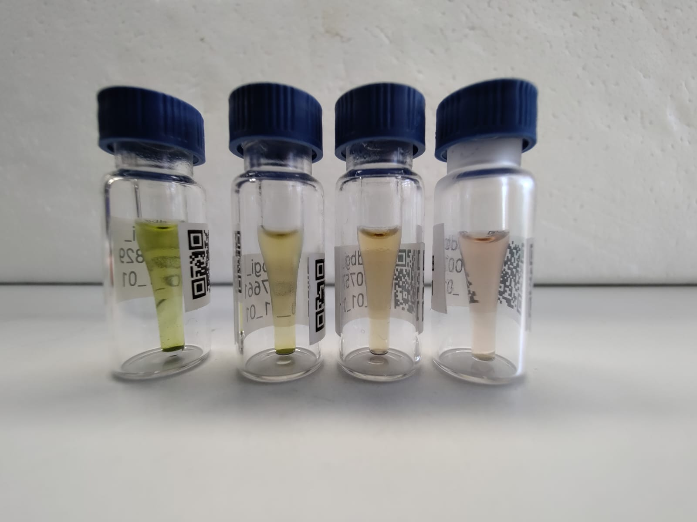

---
# Tree sampling
In this project, we will apply the already tested DBGI methodology to trees. They differ from precedently sampled plants as they bear lignified organs (bark, branches, pinecones, ...) which cannot be pulverised by the sphercical metal beads used in the standard protocol. However,this nuisance might be overcome by using discoid beads.

So far, each sample wasn't considered as being linked to a peculiar specimen. They were considered independant from each other, even tho they came from the very same individual. As the samples were mostly leaves. This wasn't a big issue for not much more than a single sample was taken from a same indivudal.

In this regard, trees offer an interesting challenge and an opportunity to further develop the EMI tools as they are perennial, and don't present all of their organs at the same time. Therefore, being able to attach samples to a specific individual could allow to come back to collect missing organs or study the modifications of the metabolome through the year(s).
To achieve this, UUID codes were generated and attached to the specimen's panel. For now, ticks can be made at the back of the code to mark and follow the progression of the sampling on the specimen.

Approximately 130 trees of the botanical garden have been sampled for this bachelor's work. They are scattered all over the garden, with a greater concentration in the arboretum, and near the fences as hedges. They tend to come from all over the world with local species (_Picea abies_) aswell as tropical ones (_Persea americana_). This work might show a strong bias toward gymnosperms as they present leaves all year long (the bachelor's work took place from februrary to june), and many trees didn't show any leaves before the end of march.
How are they placed in the garden ? Taxonomic/usefulness reasons? Remains of the old organisation of the garden ?

### Sampling

  The classical DBGI methodology was mostly applied to collect the different organs. The main difference being the use of a standard secateurs, and a telescopic one to cut branches off.
  For each sample, the geographical position of the specimen will be marked down on the JBUF QField map (should I add a paragraph explaining what QField is?)
  At least 5 pictures must be taken for each sample:

    1) The whole specimen.
    2) The identification panel with the UUID QR-code.
    3) The identification with the UUID QR-code and the number of the sample.
    4) Details of the plant.
    5) The sampled zone indicated by the cutter.
    6) Additional picture, if judged necessary.
  See an exemple of _Picea jezoensis_.
 
   {max-height: 600px, max-width: 600px, display: block, margin: 0 auto}
   _Fig.XX-XX: General picture of Picea jezoensis_

  {max-height: 600px, max-width: 600px, display: block, margin: 0 auto}
  _Fig.XX-XX: Picture the UUID and panel of Picea jezoensis_

  {max-height: 600px, max-width: 600px, display: block, margin: 0 auto}
  _Fig.XX-XX: Picture of the UUID, the panel, and a sample code of Picea jezoensis_

  {max-height: 600px, max-width: 600px, display: block, margin: 0 auto}
 _Fig.XX-XX: Detailled picture of the branch, needles, and buds of Picea jezoensis_

  {max-height: 600px, max-width: 600px, display: block, margin: 0 auto}
  _Fig.XX-XX: The location of the sampling is indicated with the scalpel_

   (demander comment faire pour avoir une légende clean) 

  The different pictures and the geolocalisation of the sampled plants, are then imported on iNaturalist (should I add a paragraphe to explain what iNat is ?) to confirm the belonging of the specimen to a species. This, allows the collectors to harvest large quantities of plant matter without having to be trained botanists themselves, speeding up the progression of the project and allowing for interesting citizen science initiatives.
  
  The organ must be separated from the parent organism. After the cut, the organ is wrapped in a brown coffee filter, and shoved in a falcon tube closed with a perforated cap. Each tube is pre-labeled with a unique QR-code which allows to identify and track the sample through its preparation and storage.
  The tubes are then temporarily submerged in liquid nitrogen.
  At the end of the sampling session, all the tubes are stored in a -70°C freezer, if they can't be freeze-dryed immediately.

  ### Extraction 

  The freeze-drying process needs to be at least 72 hours long to make sure the samples are absolutely dry. 
  Directly after the freeze-drying process, all the perforated caps need to be switched with standard, disinfected, non-perforated caps to avoid contamination from the environment. The falcon tubes are then scanned and stored in a labeled rack. From now on the tubes will be stored in said racks to allow easy access to the sample if need be.
  The first step of the extraction process is the weighing. 50 mg needs to be weighted and inserted in a 2ml Eppendorf tube with a rounded bottom. 3 metal beads, or 3 disc beads if the sample is a needle or lignified, are added. An error up to 5% is accepted. To separate the tubes containing  normal beads from the discoids beads, the letter β is written on the tubes containing the discoid beads.

  The Eppendorf tubes then go in the MM40 Retsch machine (shaker) for 2.5 minutes at 25Hz for standard beads and 5 minutes at 25Hz for the discoid beads. Then, 1,5ml of the DBGI extraction solution is added. Said extraction is made of a mix of 80% methanol, 20% distilled water, and 0,1% formic acid. The newly rehydrated samples go back in the Retsch machine for a second ride with the same settings.
  
  The tubes are then taking a turn in a centrifugation machine for 2 minutes at 13'000 RPM to separate the supernatant from the plant deposit which precipitates.

  Afterward, as much of the supernatant (usually 1,4 ml) is collected and pipetted in a glass vial with a hermetically sealed cap. Solid parts need to be avoided for they clogg the LC-MS.
  The vial need to be labelled and associated to a container, ensuring the continued tracking of the sample from the garden to the freezer.
  The vials container is then stored in a -70	°C freezer, and is ready for LC-MS and analysis. These vials can be reused if needed.

  {max-height: 600px, max-width: 600px, display: block, margin: 0 auto}
  _Fig.XX-XX: Ready to use red vials_

  ### Analysis
Demander les détails à Colin et doc Hloise

 Before taking a turn in the LC-MS, 120 microliters of the extracted liquid is pipetted in a new glass vial containing an insert (see next fig). The vials are closed with a slitted cap which allows the machine to access the solution. These aliquots are the final step needed before analysing the samples.
  
  {max-height: 600px, max-width: 600px, display: block, margin: 0 auto}
  
  _Fig.XX-XX: Aliquots ready for ayses_
  
These vials are are closed using a slipped cap. These aliquots are then analysed by liquid chromatography mass spectrometry (LCMS) and their spectra are analyzed by using bioinformatic tools.

