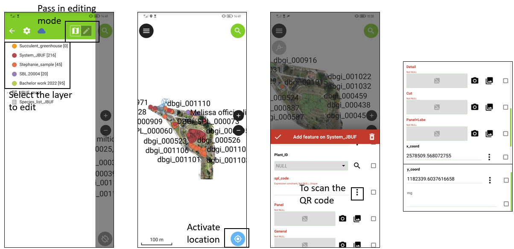

## Before collection

**Make sure you have your collection application setup.** If not, you can go here to set it up: [[Bioblitz.Vinesch-Bioblitz.software]]

If you are ready, synce the project to obtain the latest version. It will take the latest files on the server and store it locally on your phone. Normally, if some modification are available on the cloud, you should have an exclamation mark inside the blue cloud.

How to proceed:
- After opening the project, click on the blue cloud
- Then hit Synchronize

## Add features
- Select the layer you want to edit and pass in editing mode (see image below).
- Optionnaly, you can activate the GPS location to locate you approximatively on the field.
- When you point the plant location, tap on the "plus" button. This will make appear a form that you can fill.

## Fields to fill
- collector_fullname corresponds to your name. If you are not in the list, you can add yourself by filling the "collector_list" layer (same process as above). Check the box on the right to keep the selection between observations.

- observation_subject corresponds to the organ/part of the specimen you want to collect. If you don't find a correct term, you can add it by filling the "observation_subject" layer. Check the box on the right to keep the selection between observations.

- inat_upload is a tick button that allows you to choose whether your observation has to be uploaded on iNaturalist or not. This option is ticked by default. Example cases when this button has to be unticked: non-living samples (soil, water, ..) or multiple macroscopic species (20x20cm whole sampling for example). Check the box on the right to keep the selection between observations.

- taxon_name field corresponds to the scientific name of the plant (open form where you can search on). If you are unsure or you don't know the species no worry, it's why we upload the observations on iNaturalist.

- no_name_on_list is a tick button you can tick if the specimen you are observing is not present on the taxon_name list. It will make appear a field called name_proposition where you can write free text to identify the specimen

- sample_id is the code sticked on the tube. You can scan it by clicking on the 3 dots.

- Then you have 5 (+1 optional if needed) pictures to take of the species, one of the specimen label (if available), one in general, one of the plant's details (flowers or remarkable details that permit identification), one where you cut and one with the species label (if availabe) and the dbgi code on the tube.

- The form contains two more tabs containing individual and environmental fields. These fields are optional. You can choose to fill them or not, following the results you want to obtain. You have free comments in these tabs, so if you want to add informations on the samples, you can add them here ("comment_eco" and "comment_env")

- Once done, the upper of the form should be green, and you can add you observation to the project by clicking on the tick in the upper left corner.

- Now you can collect the sample and put it in a tube. If you don't know how to do it, you can follow this guide: [[Bioblitz.Vinesch-Bioblitz.prelevation-protocol]]

- You have done your first observation!

## Alternative to specimen collection

There is also an observation layer (finish by _obs). This layer is made to observe specimens that can't be collected (vertebrates, protected species, ...). They will then be uploaded to iNaturalist and enter the database to possibly collect them during another collection process.

## Upload your features
**This system works offline, so each time you finish your collection, you need to update the project on the server.**

To do that: 
- Click on the little cloud and click on "push modifications". 
- Wait until all is synced. Finished!

{max-width : 600px, display: block, margin: 0 auto}