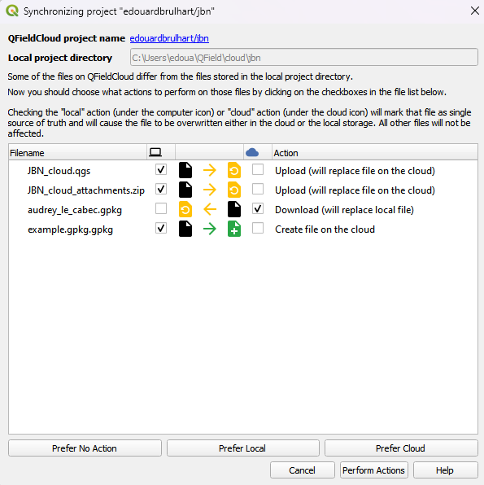

# Welcome to the DBGI plugin page!

## This plugin aims to suit the needs for the DBGI project on QGIS.

### Description:

For instance, this plugin performs two tasks:
- Creating geopackage layers for the Digital Botanical Gardens Initiative project
- Modifying deprecated geopackage layers created with the v0.1 of this plugin

In the future, this plugin could eventually perform more tasks depending on te DBGI project's needs.

### Example of use:

#### 1. Install the plugin: 
- Open QGIS, go to Plugins -> Manage And Install Plugins... -> All -> DBGI
- Or download the zipped plugin [here](https://github.com/digital-botanical-gardens-initiative/gpkg_creator/releases/download/v0.2/gpkg_creator_v2.zip), open QGIS and go to Plugins -> Manage And Install Plugins... -> Install from ZIP and select the zipped file to install it.

#### 2. Create a geopackage for the DBGI project:
- Open the needed QGIS project (to know how to do it, go [there](https://www.dbgi.org/dendron-dbgi/notes/qug423ond4xtns8lelu38p2/) )
- In QGIS go to Vector -> DBGI -> Create a DBGI geopackage
- Enter the name of your geopackage (no white space please)
- Choose the species names layer (.csv or .gpkg). If there is no species names layer, add one to the project (A new feature will come if no species names layer available, work in progress...)
- Choose the field in the species names layer that contains the binomial nomenclature
- Save with ctrl + s. Your new layer is now added to the QGIS project.

#### 3. Sync back with QFieldCloud
- In the QGIS project, go to Plugins -> QFieldSync -> Syncrhronize Current Cloud Project
- !!! Warning !!! At this step you could corrupt the project. So make sure to click on Prefer cloud, and then tick under the little laptop icon only your layer (your_layer_name.gpkg), the cloud attachment (extension _attachment.zip) and the project (extension .qgs) (Figure 1).

{max-width : 600px, display: block, margin: 0 auto}*Figure 1: Add the layer to the cloud project*