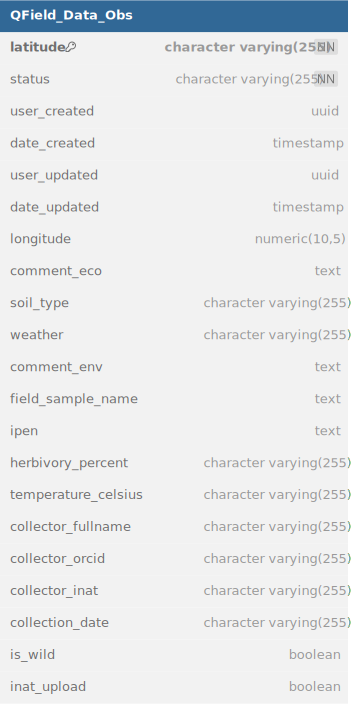

QField_Data_Obs table (*Figure 1*) permits to store the observations we made on the field without collecting. This is a solution we found to keep a track on specimens we couldn't collect at this time because no clear collection process (mammals or birds for example):

- latitude: The latitude of the observation. Acts as unique identifier. As the organism hasn't been collected, there is field_sample_id to connect.

- status: The status of the observation. For example, *collected* if the organism has been collected in a new collection cession.

- user_created, date_created_user_updated, date_updated: Informations about who created/modified the QField_Data_Obs informations and when.

- longitude: The longitude of the observation.

- comment_eco: Stores possible comments from the collector on the ecology of the observed specimen

- soil_type: The type of soil present where the specimen has been observed.

- weather: Weather during the observation process.

- comment_env: Stores possible comments from the collector on the environment of the observed specimen.

- field_sample_name: The taxon name of the observed specimen

- ipen: The unique identifier of the specimen. Only present for botanical gardens specimens, given by the botanical garden.

- herbivory_percent: Only for plants and mushrooms. Gives the percent of specimen eaten by an herbivor.

- temperature_celsius: Temperature during the observation process.

- collector_fullname: Fullname of the observer.

- collector_orcid: the ORCID of the observer.

- collector_inat: iNaturalist username of the collector. Permits to tag the collector while observation is uploaded in iNaturalist.

- collection_date: The date of the observation

- is_wild: Boolean field that indicates if the observed specimen is wild or captive.

- inat_upload: Boolean field that indicates if the observed specimen should be uploaded in iNaturalist or not. Makes the difference between unique macroscopic specimen observations and multiple/microscopic/non-living objects observations.

*Figure 1: QField_Data_Obs table structure*