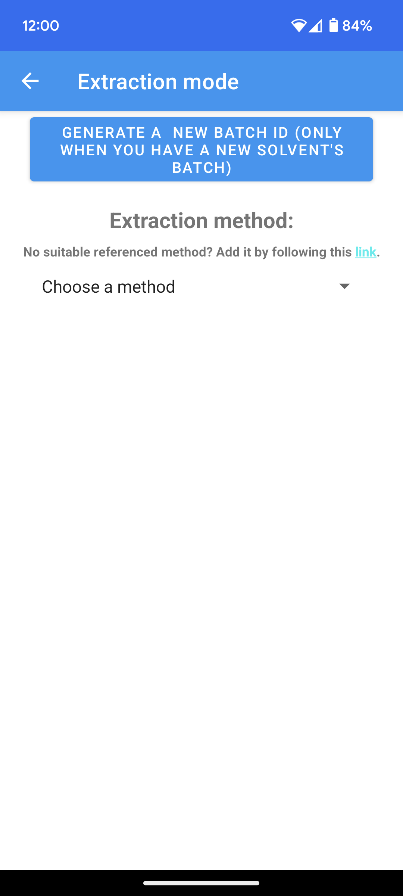
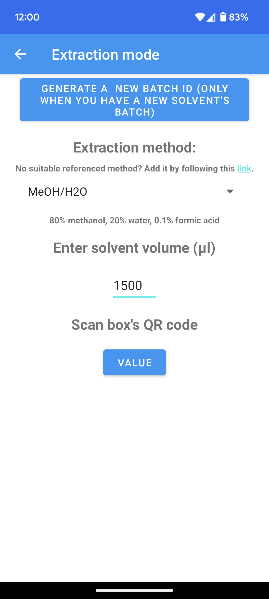
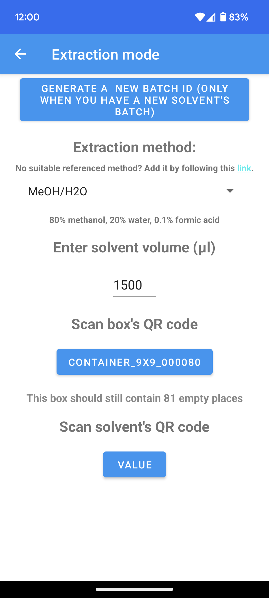
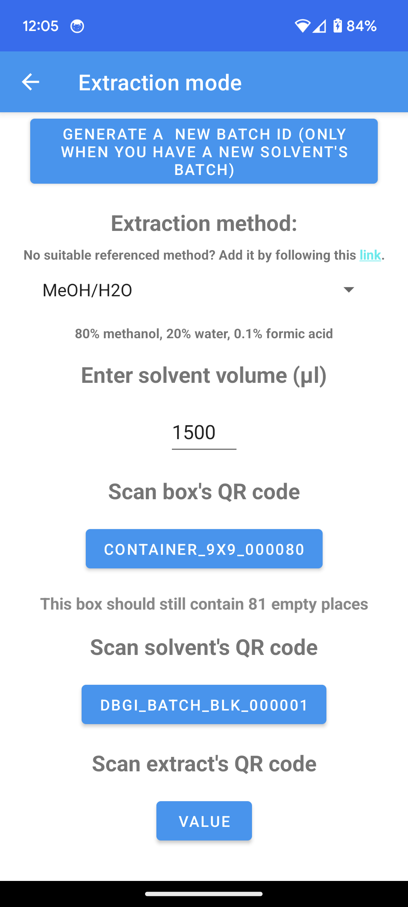

When the user arrives to this mode, he has to choose an extraction method. If there is no suitable extraction method, the user can create one following the link to [[Master-Works.Edouard-Brülhart.Services.Directus]] and ad an entry in the database. The method will then appear in the dropdown menu. He can also create a new batch (*Figures 1 and 2*). This solvent batch is here to track the solvent quality and to detect possible contaminations. If there are contaminations, we can know which samples have been extracted with this solvent. By clicking on this button, the printer will print 2 labels, one for the blank and one for the batch.

*Figure 1: Laboratory application's extraction mode when user selects it*

*Figure 2: Laboratory application's extraction mode when user chooses an extraction method*

After extraction method selection, the user has to add the solvent volume he added to the samples (*Figure 3*).

*Figure 3: Laboratory application's extraction mode when user has to scan a valid vial box*

After the scan of a valid vial box, the user has to scan a valid solvent batch, present on the solvent container (*Figure 4*).

*Figure 4: Laboratory application's extraction mode when user scanned a valid solvent batch*

The user can now begin to scan the extracts to print labels for the extract vial (*Figure 5*).

*Figure 5: Laboratory application's extraction mode when user is ready to scan samples*