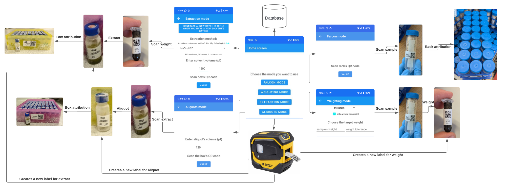

The laboratory application is an android application coded using [Kotlin](https://kotlinlang.org/) programming language with [Android Studio](https://developer.android.com/studio?hl) IDE (Integrated Development Environment). Android Studio permits to create and test the application on Android phones.

The application can be downloaded [here](https://github.com/digital-botanical-gardens-initiative/DBGI_tracking_android/releases).

This application is free and open source. The source code can be found [there](https://github.com/digital-botanical-gardens-initiative/DBGI_tracking_android).

## [[Master-Works.Edouard-Brülhart.Laboratory.Laboratory Application.Connection]]

The application will ask [[Master-Works.Edouard-Brülhart.Services.Directus]] credentials in order to have access to the database. If the connection is successful, it will redirect to the printer connection screen to choose if the user wants to connect a [Brady](https://www.brady.eu/) printer or not. For now, the compatible printers are [Brady M211](https://www.bradyid.com/label-printers/portable/m211-portable-bluetooth-label-printer-pid-170380) and [Brady M511](https://www.bradyid.com/label-printers/portable/m511-portable-bluetooth-label-printer-pid-170969).

## [[Master-Works.Edouard-Brülhart.Laboratory.Laboratory Application.Home-Page]]

The Home Page screen permits to choose which step in the laboratory you want to perform. Actually, six modes are available (*Figure 1*):

- Falcon Mode

- Weighting Mode

- Extraction Mode

- Aliquots Mode

- Signaling Mode (available soon)

- Find Mode (available soon)

## [[Master-Works.Edouard-Brülhart.Laboratory.Laboratory Application.Falcon-Mode]]

The Falcon Mode permits to associate the field samples colleced in Falcon tubes to a 24 holes rack. The operation is made in two steps:

- Scan the rack label you want to fill

- Scan the samples you want to put inside

The application will check if there is already samples in the rack and count the ones that are added. It permits to avoid attribution errors and doesn't let users attribute more samples than the rack can contain (*Figure 1*).

## [[Master-Works.Edouard-Brülhart.Laboratory.Laboratory Application.Weighting-Mode]]

The Weighting Mode permits to collect metadata about the weighting process and also prints a label for the new sample created. The application will let the user choose the weight SI unit that suits the best to his need and the tolerance. The tolerance is here to avoid typing errors during the weight entry. The user can also choose to ignore weight constraint to have a completely free weighting cession.

Once these options are set, the user will then have access to a QR reader to scan samples and attribute the weight. If a printer is connected, the label for the new sample will be automatically printed. This label is suffixed _tmp, as it is a transitional object that won't be kept after the extraction process (*Figure 1*).

## [[Master-Works.Edouard-Brülhart.Laboratory.Laboratory Application.Extraction-Mode]]

The extraction Mode permits to collect metadata about the extraction process and also prints a label for the extract vial. The user has the option to generate a new batch ID, that permits to track the solvent quality. If thi button is pressed, two labels will be printed, one for the solvent batch, in order to link it with the samples extracted with this solvent, and the other one to create a blank of this solvent in order to track the quality. Then the user can choose the extraction method and enter the solvent volume he will add to the sample. Then he will have to scan a vial box in order to associate the newly created solvents to this box. There is the same check as with Falcon rack to avoid attribution errors.

Once thes options are set, the user will then have access to a QR reader to scan weighted samples and create the extract label, that is the same as in the Weighting mode but without _tmp suffix, as the extract will enter in the extract collection (*Figure 1*).

## [[Master-Works.Edouard-Brülhart.Laboratory.Laboratory Application.Aliquots-Mode]]

The aliquot mode permits to collect metadata about the aliquot process and also prints a label for the aliquot vial. The user has to enter the volume he wants to prelevate and scan a vial box.

Once thes options are set, the user will then have access to a QR reader to scan extracts and create the aliquot label (*Figure 1*).

*Figure 1: Laboratory application workflow*

## [[Master-Works.Edouard-Brülhart.Laboratory.Laboratory Application.Signaling-Mode]]

This mode is for now a state-in-progress. It is not available for now.

It is here to change status of all sorts of samples if they are broken, lost, empty, etc. That option aims to manage the whole sample storage in order to keep it up-to-date.

This use-case can already be performed manually using the [[Master-Works.Edouard-Brülhart.Services.Directus]] web interface.

## [[Master-Works.Edouard-Brülhart.Laboratory.Laboratory Application.Find-Mode]]

This mode is for now a state-in-progress. It is not available for now.

It is here to permit user to find where a specific sample is stored, using the racks and/or boxes associated to it.

This use-case can already be performed manually using the [[Master-Works.Edouard-Brülhart.Services.Directus]] web interface.