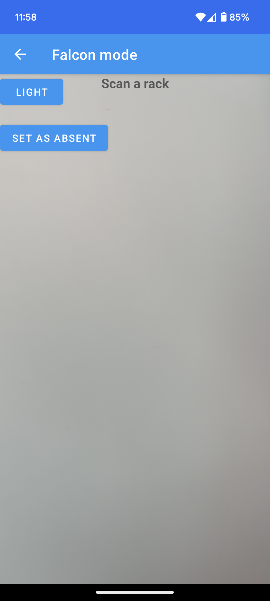
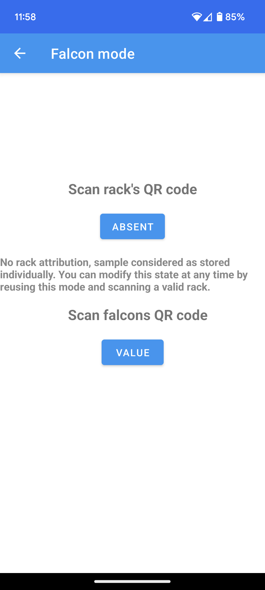
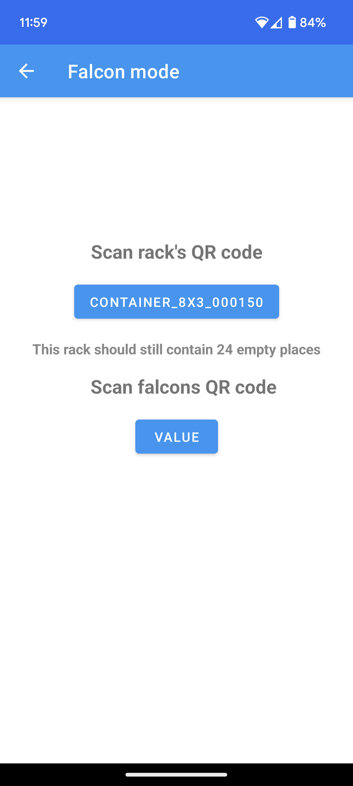

The Falcon mode permits to attribute the field samples to a container. When teh user enters the mode, he is asked to scan a valid container (*Figure 1*).

*Figure 1: Laboratory application's falcon mode when user selects it*

The scan of a rack is mandatory to continue the process (*Figure 2*). This forces the users to track correctly the samples and to avoid errors. If the samples can't be stored in a valid container, the user can declare them absent. This signifies that the samples are expected to be stored individually because of their big size (*Figure 3*).

*Figure 2: Laboratory application's falcon mode when user wants to scan a rack*

*Figure 3: Laboratory application's falcon mode when user chose absent option *

Once the user has scanned a valid rack or declared the samples as absent from a rack, the user can proceed to samples scanning to attribute them (*Figures 3 and 4*)

*Figure 4: Laboratory application's falcon mode when user scaned a rack*