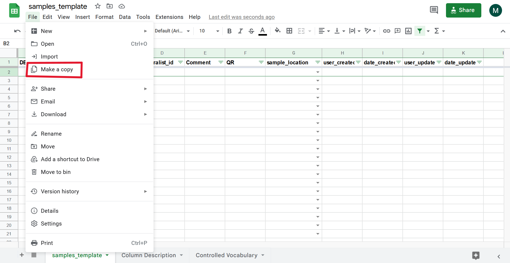
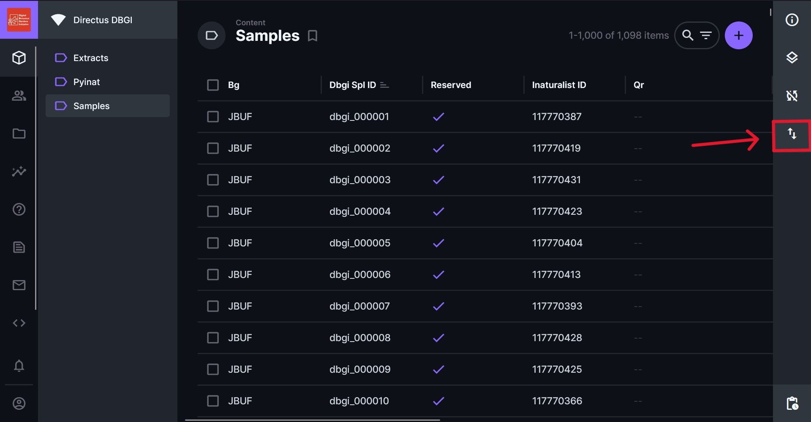
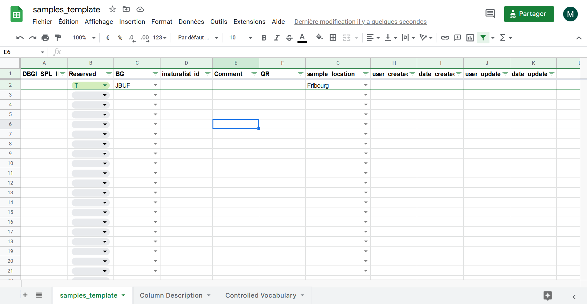

## Explore the tables
The data can be explored by going in the 'content' section (Cube on the module bar). The tables are listed on the left.           
By clicking on one item, one can navigate through all the values of that one item. Some tables are read-only mode (e.g. Pyinat) and others can be edited (e.g. Samples).      
One can search for a particular item on the top right part and add a filter to see only items of interest.

The data can be visualized with other layouts (e.g. map) than the table one by changing the layout options on the right menu.

## How to add items to the samples table

1. Copy the Google sheet [template](https://docs.google.com/spreadsheets/d/1InPLr6_0xfWM-2EsMkkRt4Nxzvg_4ju8qRBxP4RzaXU/edit?usp=sharing):
{max-width : 600px, display: block, margin: 0 auto}
Or export the table as a csv from directus:
{max-width : 600px, display: block, margin: 0 auto}
{max-width : 600px, display: block, margin: 0 auto}

2. Fill the template with your data (no need to add the dbgi_spl_id,user_created,date_created,user_updated,date_updated - it is autoincremented)
{max-width : 600px, display: block, margin: 0 auto}

3. Save the file in a **COMMA** separated csv file

4. Import the data on directus
{max-width : 600px, display: block, margin: 0 auto}

### redo sequence
If one does a mistake and needs to get back in the incremantation of the emi_external_id:
1. Delete the wrong entries
2. Connect to the psql database ![[database.tutorial.postgres#connect-to-postgresql]]
3. Restart the sequence padding ![[database.tutorial.postgres#restart-the-sequence-padding]]

## Change password

In the 'user directory' section (peoples on the module bar), one can select its own user and change its password and other informations.
