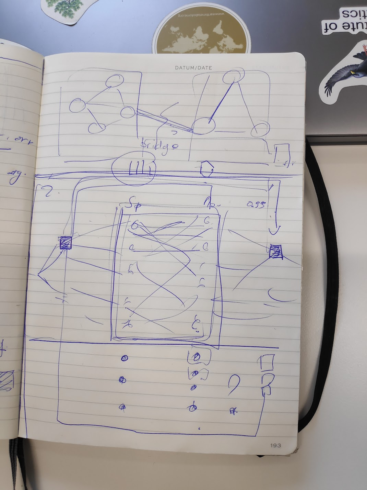

# This is Marco's daily open-notebook.

Today is 2024.01.09

## Notes
Interesting video for managing big projects in python : https://www.youtube.com/watch?v=tAuRQs_d9F8&t=169s
## Todo today
* prepare questions for Luca !!!
* 

## Doing

## Done
### Questions for Luca:
#### Lotus
We don't want to increase data with ChEBI or NCBItaxon or whatever. We just want to try to complete a bit LOTUS. 

Then maybe be able to add new species and new molecules (see question below with *inductive*)

* Why can't I merge a graph with edge weights with an other that has no weights. Why can't we do that ever if the edges are of different type ?
* Since we have a graph that evolves quickly, what are the algorithm that are *inductive* and not *transductive*. I personally used GraphSAGE but it is supposed to work only on homogenous graphs which is not our case. 
* Can we think about making predictions of higher order such as linking molecular pathways WITH Genus or families of organisms ? 
* How can I train the model ? 
* Should I train/test split on heterogenous nodes only ?
* Should I run the edge prediction pipeline ? 
* What kind of embedding should we go for ?
* How can I perform grid search to look for the best embedding on the cluster ? I was able to run stuff on the cluster but when I put them as list it seems like 
* How can I train the model to only train and test edges that are `biolink:in_taxon` ?
* How can I use edges weights for the edge predictions ?

#### EMIKG
* What should I do ? 
* OOP ? start class creation ? 
* What are these datatables things ?

## Todo tomorrow
